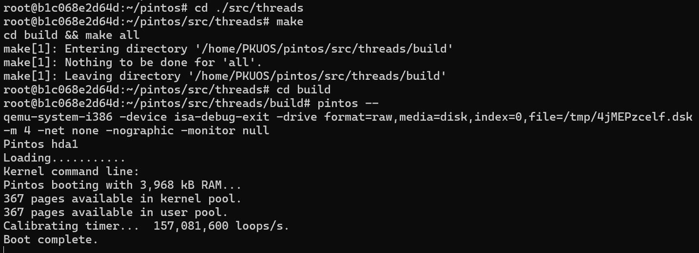
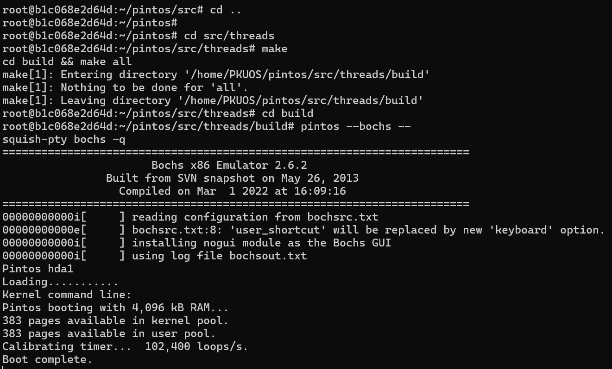
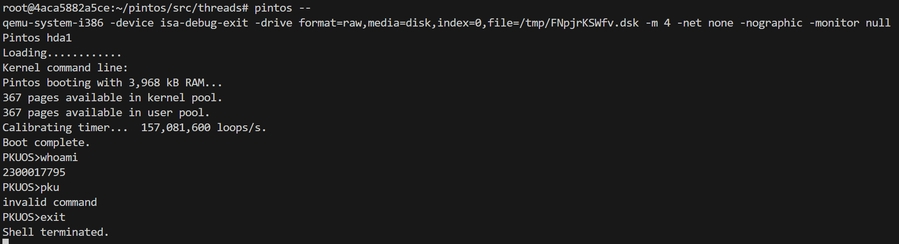

# Project 0: Getting Real

## Preliminaries

>Fill in your name and email address.

Chang Shi <2300017795@stu.pku.edu.cn>

>If you have any preliminary comments on your submission, notes for the TAs, please give them here.

>Please cite any offline or online sources you consulted while preparing your submission, other than the Pintos documentation, course text, lecture notes, and course staff.

BIOS Interrupt Vector Table

## Booting Pintos

>A1: Put the screenshot of Pintos running example here.

## Debugging

#### QUESTIONS: BIOS 

>B1: What is the first instruction that gets executed?

[f000:fff0]    0xffff0: ljmp   \$0x3630,$0xf000e05b

>B2: At which physical address is this instruction located?

0xffff0

#### QUESTIONS: BOOTLOADER

>B3: How does the bootloader read disk sectors? In particular, what BIOS interrupt is used?

call a function `read_sector`. \
int 0x13, AH = 42, which implies "Extended Read Sectors" function.

>B4: How does the bootloader decides whether it successfully finds the Pintos kernel?

While `read_sector` is called, it stored error code of "int 0x13" instruction in CF. After the function returns, we observe CF to know whether it has found the kernel.

>B5: What happens when the bootloader could not find the Pintos kernel?

It will call a function `no_such_drive`, put "Not found" and execute the BASIC program in disk.

>B6: At what point and how exactly does the bootloader transfer control to the Pintos kernel?

When certain scale (no more than 512 kB) of file is already loaded.\
We read the start address out of the ELF header and convert it from a 32-bit linear address into a 16:16 segment:offset address for real mode, then jump to the converted address.

#### QUESTIONS: KERNEL

>B7: At the entry of pintos_init(), what is the value of expression `init_page_dir[pd_no(ptov(0))]` in hexadecimal format?

0x0

>B8: When `palloc_get_page()` is called for the first time,

>> B8.1 what does the call stack look like?

#0  palloc_get_page (flags=(PAL_ASSERT | PAL_ZERO)) at ../../threads/palloc.c:113\
#1  0xc00203aa in paging_init () at ../../threads/init.c:168\
#2  0xc002031b in pintos_init () at ../../threads/init.c:100\
#3  0xc002013d in start () at ../../threads/start.S:180

>> B8.2 what is the return value in hexadecimal format?

(void *) 0xc0101000

>> B8.3 what is the value of expression `init_page_dir[pd_no(ptov(0))]` in hexadecimal format?

0x0

>B9: When `palloc_get_page()` is called for the third time,

>> B9.1 what does the call stack look like?

#0  palloc_get_page (flags=PAL_ZERO) at ../../threads/palloc.c:113\
#1  0xc0020a81 in thread_create (name=0xc002e895 "idle", priority=0, function=0xc0020eb0 <idle>, aux=0xc000efbc) at ../../threads/thread.c:178\
#2  0xc0020976 in thread_start () at ../../threads/thread.c:111\
#3  0xc0020334 in pintos_init () at ../../threads/init.c:119\
#4  0xc002013d in start () at ../../threads/start.S:180

>> B9.2 what is the return value in hexadecimal format?

(void *) 0xc0104000

>> B9.3 what is the value of expression `init_page_dir[pd_no(ptov(0))]` in hexadecimal format?

0x103027

## Kernel Monitor

>C1: Put the screenshot of your kernel monitor running example here. (It should show how your kernel shell respond to `whoami`, `exit`, and `other input`.)

>C2: Explain how you read and write to the console for the kernel monitor.

how to read:\
I use `input_getc` function in devices/input.c, which is able to read one character at a time. \
how to write:\
`printf` function similar to that in C standard lib is provided in lib/stdio.c, so I just use it.
