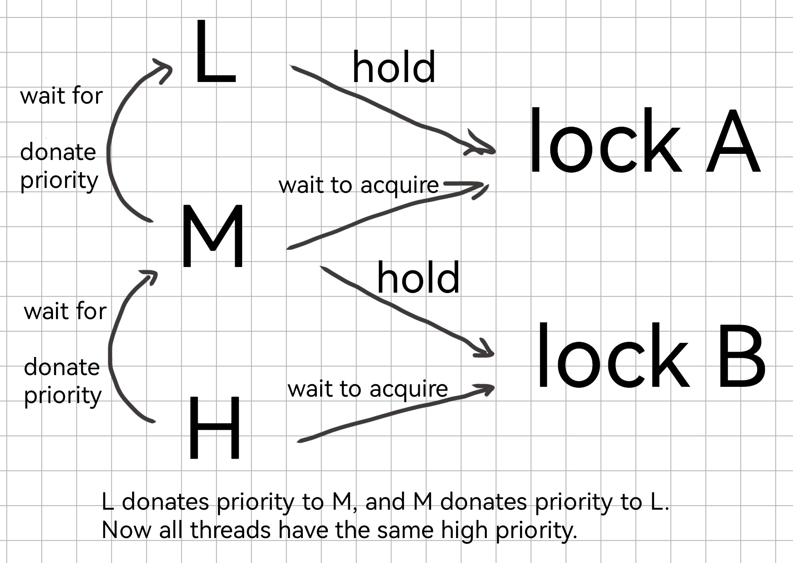
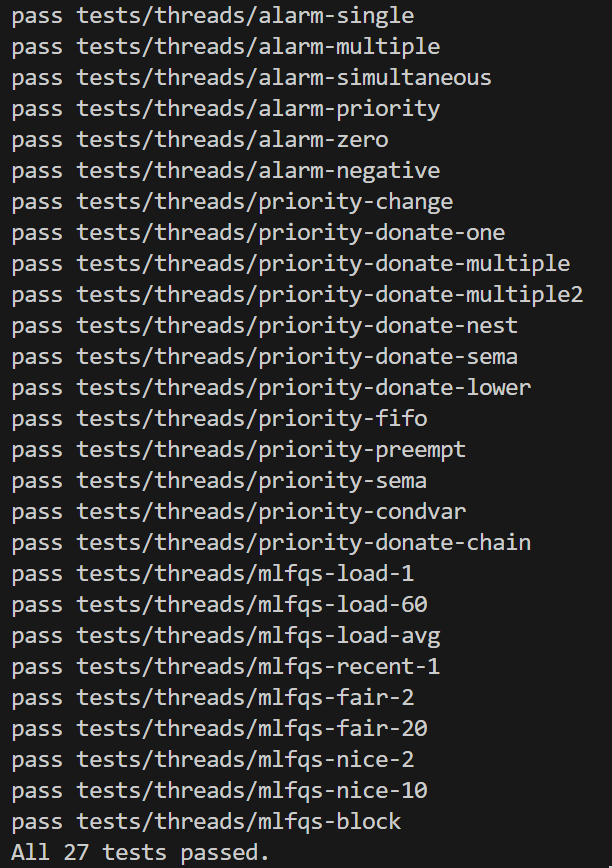

# Project 1: Threads

## Preliminaries

>Fill in your name and email address.

Chang Shi <2300017795@stu.pku.edu.cn>

>If you have any preliminary comments on your submission, notes for the TAs, please give them here.

>Please cite any offline or online sources you consulted while preparing your submission, other than the Pintos documentation, course text, lecture notes, and course staff.

## Alarm Clock

#### DATA STRUCTURES

>A1: Copy here the declaration of each new or changed struct or struct member, global or static variable, typedef, or enumeration.  Identify the purpose of each in 25 words or less.

1. Add an list `sleep_list` to record sleeping threads

   ```c
   static struct list sleep_list;
   ```

2. Add an member `sleep` in `struct thread` in order to record how many ticks are left to wait in the thread
3. Add a list element `selem` in `struct thread` to be stored in `sleep_list`

   ```c
   struct thread{
     // something
     struct list_elem selem;
     int64_t sleep;
     // something
   };
   ```

#### ALGORITHMS

>A2: Briefly describe what happens in a call to `timer_sleep()`, including the effects of the timer interrupt handler.

First, we check whether `ticks` is nonpositive, if is `timer_sleep()` immedietely returns. \
Second, we disable interruption (meanwhile we record `old_level`), set `sleep` value, put it in `sleep_list`, and then we block the thread. \
Last, we set back `old_level`.

As the interrupt handler invokes `thread_tick()`, we substract 1 from each of the threads whose `sleep` value is positive. If `sleep` is changed to 0, we unblock the thread and remove it from `sleep_list`.

>A3: What steps are taken to minimize the amount of time spent in the timer interrupt handler?

We avoid using complex data structures and try to minimize the instructions to update `sleep` in each thread.

#### SYNCHRONIZATION

>A4: How are race conditions avoided when multiple threads call `timer_sleep()` simultaneously?

We avoid interruption when setting `sleep` value and dealing with `sleep_list`, guaranteeing multiple threads could modify it sequentially and would not influence each other. When a tick ends, all concerned threads would count that tick.

>A5: How are race conditions avoided when a timer interrupt occurs during a call to `timer_sleep()`?

When modifying `sleep` value and `sleep_list`, we disable interruption to guarantee this crucial process would not be disturbed. Before or after that, it doesn't matter.

#### RATIONALE

>A6: Why did you choose this design?  In what ways is it superior to another design you considered?

I once designed a pure algorithm: `sleep_list` not existing, and checking all threads during each time interruption. In first few test cases, it worked quite well. However, it fails in for example, `mlfqs-load-60` and `mlfqs-load-avg` because the starting of around 60 threads takes too much time!

I thought over and found that there's no need to check all threads at each interruption, since only a minority of them will be sleeping. So I choose the current design, creating a `sleep_list` to record sleeping threads. Experiments indicate that it works!

## Priority Scheduling

#### DATA STRUCTURES

>B1: Copy here the declaration of each new or changed struct or struct member, global or static variable, typedef, or enumeration.  Identify the purpose of each in 25 words or less.

1. Add an member `ori_priority` in `struct thread` in order to record its original priority (ignorant of any priority donation)
2. Add a pointer to a list to record which list the thread is in (Besides `all_list`, a thread is in at most one list!)
3. Add a pointer to a thread to record which list the thread is waiting for.
4. Add a pointer to a lock to record which lock the thread is waiting for.

   ```c
   struct thread{
    //something
    int ori_priority;
    struct list* in_list;
    struct thread* waiting_for;
    struct lock* waiting_lock;
    //something
   };
   ```

Notice that a thread could be waiting for at most one thread and one lock.

5. Define `TOTAL_PRI` and `MAX_STEP`. There are totally 64 priorities. When calculating priority donation, we only consider donation paths with lengths no more than 8.

   ```c
   #define TOTAL_PRI 64
   #define MAX_STEP 8
   ```

6. Modify `ready list` to 64 lists, each recording ready threads in each priority.
   ```c
   static struct list ready_list[TOTAL_PRI];
   ```

>B2: Explain the data structure used to track priority donation. Use ASCII art to diagram a nested donation.  (Alternately, submit a .png file.)

I do not use any complex data structure, instead, I just use 3 pointers to record necessary information. How they work is discussed in part B1 & B4 & B5.



#### ALGORITHMS

>B3: How do you ensure that the highest priority thread waiting for a lock, semaphore, or condition variable wakes up first?

In pintos, locks are immplemented using semaphores.

Whenever we add a thread into a semaphore's waiting list, we maintain the order in list. When waking a thread up, we just pop the first element in waiting list.

In conditoin variable, we create 64 waiting queues storing threads of 64 priorities. We add a thread to some queue according to its priority. When waiting a thread up, we check queues from high-priority ones to low-priority ones, find the first nonempty queue and pop the first element.

>B4: Describe the sequence of events when a call to `lock_acquire()` causes a priority donation.  How is nested donation handled?

If the lock acquired is free, the thread directly acquire the lock and update `holder` of the lock.

If the lock acquired is occupied, we update the thread's `waiting_for` and `waiting_lock`. Then, we donate priority recursively along `waiting_for`. After the thread acquires the lock, we update `waiting_for` and `waiting_lock` to NULL.

>B5: Describe the sequence of events when `lock_release()` is called on a lock that a higher-priority thread is waiting for.

First we update `holder` to NULL. Then we `sema_up`: we put it at the first step because after which no higher-priority threads would emerge. Next we update priorities globally: we set `priority` of threads which would be influenced potentially to their `ori_priority`, recursively along `waiting_for`. After that, all threads donate priority to their `waiting_for` threads, which is repeated 8 times.

#### SYNCHRONIZATION

>B6: Describe a potential race in `thread_set_priority()` and explain how your implementation avoids it.  Can you use a lock to avoid this race?

A potential race: a thread attempts to lower its priority, and halfway another thread with currently higher priority races to controll, which might cause priority updating fault.

We disable interruption when updating other threads' priorities. After that, we check if the current thread should yield.

Using a lock is also a good choice, though I don't adapt it. A thread should acquire some lock before starting to run. In `thread_set_priority`, the current only releases the lock after all the updating work is done.

#### RATIONALE

>B7: Why did you choose this design?  In what ways is it superior to another design you considered?

Originally my design was simple and in good order. I used 64 lists anywhere that needed priority scheduling. However, it failed `prioity-donate-chain` because of not having enough space. So I change my design: in semaphores I only use one list, but keeping priority order when inserting or modifying. Experiments indicate that this design occupies much less space and does not show a noticable slowdown in performance.

## Advanced Scheduler

#### DATA STRUCTURES

>C1: Copy here the declaration of each new or changed struct or struct member, global or static variable, typedef, or enumeration.  Identify the purpose of each in 25 words or less.

1. Add two members (`niceness` and `recent_cpu`) in `struct thread`.

   ```c
   struct thread{
    //something
    int niceness;
    int recent_cpu;
    //something
   };
   ```

2. Add a global variable `load_avg`.

   ```c
   int load_avg;
   ```

The purposes are as their names suggest.

#### ALGORITHMS

>C2: How is the way you divided the cost of scheduling between code inside and outside interrupt context likely to affect performance?

I divide in an external interrupt context, which is more flexible and could reduce the burden of interrupt handling, thereby improving the system's response speed and real-time performance.

#### RATIONALE

>C3: Briefly critique your design, pointing out advantages and disadvantages in your design choices.  If you were to have extra time to work on this part of the project, how might you choose to refine or improve your design?

My design works correctly and efficiently. Also, I haven't introduce complex data structures or algorithms, and my code is easy to read!

However, we notice that there won't be many threads running in 4 ticks, so scanning all threads to update priorities may be somewhat inefficient. If I were to have extra time, I would add a new list `update_list` to record the threads that need to update their priority.

>C4: The assignment explains arithmetic for fixed-point math in detail, but it leaves it open to you to implement it.  Why did you decide to implement it the way you did?  If you created an abstraction layer for fixed-point math, that is, an abstract data type and/or a set of functions or macros to manipulate fixed-point numbers, why did you do so?  If not, why not?

I set last 14 bits for decimal part. It is precise enough and will not limit the maximum number we want to represent.

I created an abstraction layer, because it is convenient and makes my code easy to read.

## Grading
All 27 tests passed in my local environment.

